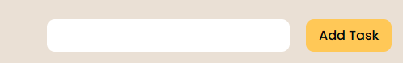
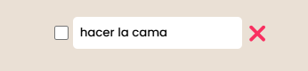
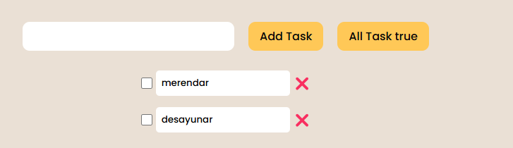

# Ejercicio extra TodoList

Para este ejercicio, vamos a crear una lista de tareas (TodoList), en la que podremos agregar tareas, modificarlas y marcarlas como completadas.

Seguramente ahora estés pensando: "Ofu no vea, que de cosas ¿Por dónde empiezo?"

Tranquilo, vamos a ir punto por punto, desglosando un poquito el ejercicio, para que así te sea más fácil. Empecemos :).

1. Montar un html con el input y el botón para agregar una tarea

Lo primero, dentro del body crea un div y dentro de ese mismo div crea el input y el botón en cuestión.

Una vez que los tengas creados, vamos a aplicarles un poquito de estilo

Aquí tienes unos estilos de prueba:

```css
.inputText {
  width: 300px;
  padding: 8px;
  border-radius: 5px;
  font-size: 1rem;
  outline: none;
}

#add {
  background-color: #ffc857;
  color: #0a0908;
  border: none;
  padding: 8px 16px;
  border-radius: 10px;
  cursor: pointer;
  font-size: 1rem;
}
```

Tendría que quedarte algo así:



Bueno, por ahora olvidate de los estilos, ya volveremos a ellos más adelante.

2. Mostrar una lista con una sola tarea

Aquí te dejamos un ejemplo de como se vería por pantalla una sola tarea en la lista de tareas



Esto esta muy bien para tantear, pero el ejercicio nos pide una lista de tareas, lo suyo sería plantearlo como una lista.

> NOTA: Puedes plantear el layout como quieras, tanto con flexbox como con grid

3. Definir la interfaz

Ahora usaremos Typescript como es debido, creando una interfaz para las tareas, Te dejamos un ejemplo:

```ts
interface Task {
  id: number;
  name: string;
  isCompleted: boolean;
}
```

También te dejamos el array que usaremos para guardar la información de las tareas:

```ts
let tasks: Task[] = [];
```

4. Recoger el valor del input

Para obtener el valor del input nos podemos crear una función, que implemente tal funcionalidad. Aquí tienes un pequeño esquema de función:

```ts
const getTaskOfInput = (): string => {};
```

**Pista 1**: Recuerda que para manipular nuestro input del DOM usabamos [document.getElementById](https://developer.mozilla.org/en-US/docs/Web/API/Document/getElementById) algo así:

```ts
const input = document.getElementById("task");
```

El string que le pases al _getElementById_ es el ID que tiene ese input, por tanto si no lo encuentra devolverá null

5. Añadir una tarea al array

Una vez que tengamos implementada la función que recoge el valor de nuestro input, vamos a crear otra función que se encargará de crear la tarea en nuestro array basandosé en la interfaz que hemos creado anteriormente. A continuación te dejamos esquema de esa función:

```ts
const addNewTask = (value: string): void => {
  // Introduce tu código aquí. Todas las tareas que agregues inicialmente tendrán la propiedad isCompleted a false
};
```

Está función tendrá que ser llamada cuando pulsemos sobre el botón de "Add Task"

**Recomendación**: Lo primero que haría yo sería probar si la tarea me aparece en un `console.log()`, solo para asegurarme de que funciona correctamente.

6. Mostrar las tareas por pantalla

Una vez que tengamos creada la función anterior y funcione correctamente, es hora de pasar a mostrar las tareas por pantalla. Definimos la función que irá creando la lista que vamos a mostrar por pantalla, Aquí te dejamos un esquema de como debe ser:

```ts
const createTaskList = (tasks: Task[]) => {
  // Introduce tu código aquí
};
```

Está función se encargará de crear dinámicamente la lista de tareas dentro del HTML

**Pista 2**: Para poder crear elementos HTML con Javascript, tenemos disponible el método: [createElement](https://developer.mozilla.org/en-US/docs/Web/API/Document/createElement).

Ejemplo de uso:

```ts
const elementoLista = document.createElement("li");
```

> De está manera acabamos de crear un li que tendrá disponible **todas** las propiedades de un li

**Pista 3**: Cuando queramos añadir el elemento creado en Javascript a nuestro HTML podemos usar [appendChild](https://developer.mozilla.org/en-US/docs/Web/API/Node/appendChild).

Ejemplo de uso:

```ts
const elementoListaDeTareas = document.getElementById("taskList");
const elementoLista = document.createElement("li");
elementoListaDeTareas.appendChild(elementoLista);
```

> Con este ejemplo añadimos un li en el ul que tiene como id `taskList`

7. Marcar una tarea como completada

Vamos a implementar la funcionalidad de marcar una tarea como completada, para conseguir tal fin crearemos una función que se encargue de cambiar el estado de la propiedad `isCompleted` de false a true. Aquí tienes un ejemplo de función:

```ts
const changeIsCompletedProperty = (id: number, newTaskList: Task[]): Task[] => {
  // Implementa el código aquí
};
```

Y así es como debería quedar:


8. Editar una tarea

Ahora pasamos a ver como se editaría el nombre de una tarea. Para ello, creamos una función que nos actualizará el nombre de la tarea con el nuevo valor y ese pasará a ser el nuevo nombre de la tarea. Ejemplo de como quedaría:

Antes de editar:


Después de editar:


Te dejo un ejemplo adicional, está vez mostrado en las devTools, para que veas que si se ha modificado el nombre


Te dejo también el esquema de la función que tendrás que implementar:

```ts
const updateTaskName = (id: number, value: string): Task[] => {
  // Introduce tu código aquí
};
```

9. Eliminar una tarea

Ahora vamos a desglosar un poco la implementación para eliminar una tarea. El primer paso, es crear el botón que al pulsarlo llamará a la función que elimina la tarea.

Función que crea el botón de eliminar

```ts
const createDeleteButton = (id: number): HTMLButtonElement => {
  const button = document.createElement("button");
  button.textContent = "❌";
  button.classList.add("delete-btn");
  button.addEventListener("click", () => {
    const updatedTasks = deleteTask(id);
    createTaskList(updatedTasks);
  });
  return button;
};
```

Está función creará el botón dentro de la lista. Ejemplo visual de como quedaría:


Y aquí tienes el esquema para implementar la función para eliminar la tarea:

```ts
const deleteTask = (id: number): Task[] => {
  // Implementa tu código aquí
};
```

Retos:

- Crear un botón que al pulsarlo marque todas las tareas como completadas

- Si yo intento meter una tarea que ya existe que me salte un error o una alerta de que esa tarea ya existe

- Si yo intento meter una tarea sin nombre que salte un error avisando de que el nombre de la tarea es obligatorio
